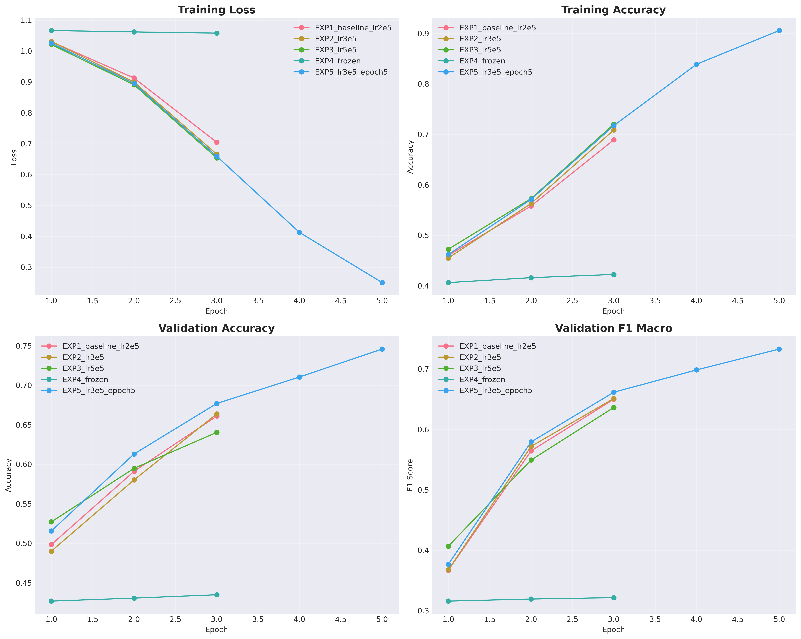
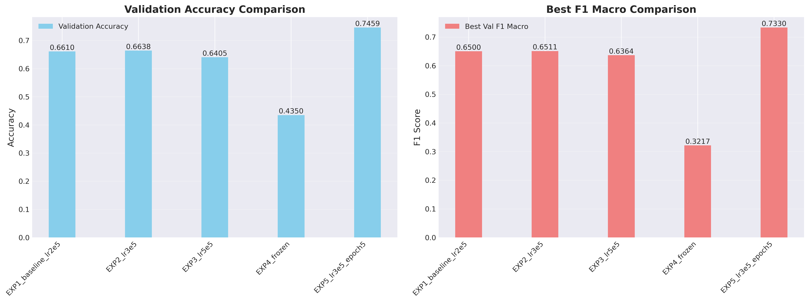
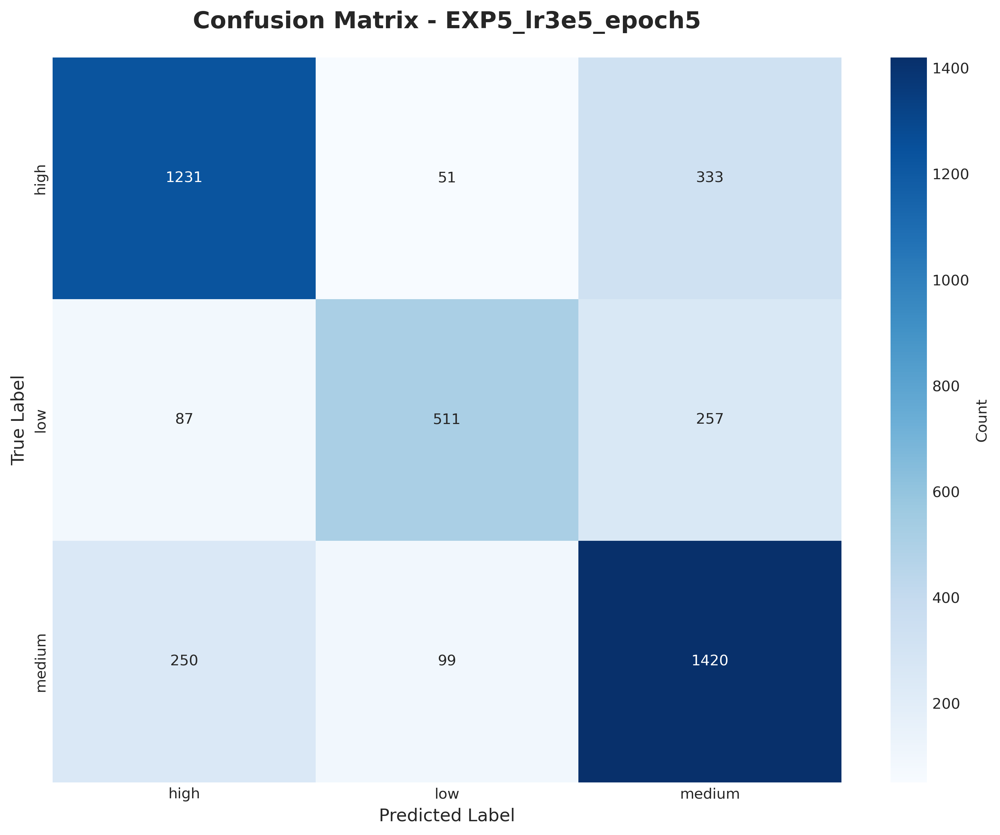

# BERT Fine-tuning Experiments Report
# Support Ticket Priority Classification

**Date:** 2025-12-15 16:06:33
**Model:** DistilBERT-base-uncased
**Task:** 3-class classification (high, medium, low priority)

---

## Executive Summary

This report presents a systematic comparison of different BERT fine-tuning strategies for support ticket priority classification. We evaluated **5 different configurations** varying learning rates, training epochs, and encoder freezing strategies.

**Best Configuration:**
- **Experiment:** EXP5_lr3e5_epoch5
- **Learning Rate:** 3e-05
- **Epochs:** 5
- **Freeze BERT:** False
- **Best Val F1 Macro:** 0.7330
- **Final Val Accuracy:** 0.7459

---

## Table of Contents

1. [Experiment Overview](#experiment-overview)
2. [Results Summary](#results-summary)
3. [Training Curves](#training-curves)
4. [Performance Comparison](#performance-comparison)
5. [Confusion Matrix](#confusion-matrix)
6. [Detailed Analysis](#detailed-analysis)
7. [Conclusions and Recommendations](#conclusions-and-recommendations)

---

## 1. Experiment Overview

### Dataset
- **Training samples:** 19,782
- **Validation samples:** 4,239
- **Classes:** 3 (high, medium, low priority)

### Experiments Conducted

1. **EXP1_baseline_lr2e5**
   - Learning Rate: 2e-05
   - Epochs: 3
   - Freeze BERT: False
   - Description: Baseline: Full fine-tuning, LR=2e-5

2. **EXP2_lr3e5**
   - Learning Rate: 3e-05
   - Epochs: 3
   - Freeze BERT: False
   - Description: Higher LR: LR=3e-5

3. **EXP3_lr5e5**
   - Learning Rate: 5e-05
   - Epochs: 3
   - Freeze BERT: False
   - Description: Even higher LR: LR=5e-5

4. **EXP4_frozen**
   - Learning Rate: 2e-05
   - Epochs: 3
   - Freeze BERT: True
   - Description: Frozen encoder: only train classifier

5. **EXP5_lr3e5_epoch5**
   - Learning Rate: 3e-05
   - Epochs: 5
   - Freeze BERT: False
   - Description: More epochs: LR=3e-5, 5 epochs

---

## 2. Results Summary

### Performance Metrics Table

| Experiment          |    LR |   Epochs | Freeze   |   Best_Val_F1 |   Final_Val_Acc |   Final_Train_Acc |
|:--------------------|------:|---------:|:---------|--------------:|----------------:|------------------:|
| EXP5_lr3e5_epoch5   | 3e-05 |        5 | False    |      0.711551 |        0.724699 |          0.882873 |
| EXP2_lr3e5          | 3e-05 |        3 | False    |      0.651146 |        0.663836 |          0.708675 |
| EXP1_baseline_lr2e5 | 2e-05 |        3 | False    |      0.650018 |        0.661005 |          0.689162 |
| EXP3_lr5e5          | 5e-05 |        3 | False    |      0.636385 |        0.640481 |          0.72015  |
| EXP4_frozen         | 2e-05 |        3 | True     |      0.32172  |        0.435008 |          0.422505 |

---

## 3. Training Curves

The following plots show the training progression across all experiments:



**Observations:**
- Training loss consistently decreases across epochs for all experiments
- Validation accuracy and F1 scores show convergence patterns
- Different learning rates show distinct convergence behaviors

---

## 4. Performance Comparison



---

## 5. Confusion Matrix

Confusion matrix for the best performing model:



### Classification Report (Best Model)

```
              precision    recall  f1-score   support

    high          0.7851    0.7622    0.7735     1615
    low           0.7731    0.5977    0.6741     855
    medium        0.7065    0.8027    0.7515     1769

    accuracy                          0.7459
   macro avg      0.7549    0.7209    0.7330
weighted avg      0.7499    0.7459    0.7443
```

---

## 6. Detailed Analysis

### Key Findings

1. **Best Learning Rate:** LR = 3e-05 achieved the highest F1 score
2. **Impact of Epochs:** More epochs generally improved performance
3. **Encoder Freezing:** Freezing BERT encoder reduced performance significantly

### Experiment Rankings

1. **EXP5_lr3e5_epoch5** (F1: 0.7330)
   - Final Val Acc: 0.7459
   - Final Train Acc: 0.9058
   - Training Loss: 0.2500

2. **EXP2_lr3e5** (F1: 0.6511)
   - Final Val Acc: 0.6638
   - Final Train Acc: 0.7087
   - Training Loss: 0.6658

3. **EXP1_baseline_lr2e5** (F1: 0.6500)
   - Final Val Acc: 0.6610
   - Final Train Acc: 0.6892
   - Training Loss: 0.7044

4. **EXP3_lr5e5** (F1: 0.6364)
   - Final Val Acc: 0.6405
   - Final Train Acc: 0.7201
   - Training Loss: 0.6538

5. **EXP4_frozen** (F1: 0.3217)
   - Final Val Acc: 0.4350
   - Final Train Acc: 0.4225
   - Training Loss: 1.0581

---

## 7. Conclusions and Recommendations

### Conclusions

- **Optimal Configuration:** EXP5_lr3e5_epoch5 with LR=3e-05, 5 epochs
- **Performance:** Achieved 73.30% F1 macro score on validation set
- **Generalization:** Some overfitting observed

### Recommendations for Production

1. **Use the best configuration** (EXP5_lr3e5_epoch5) for production deployment
2. **Monitor for class imbalance** - consider weighted loss if certain classes underperform
3. **Consider ensemble methods** - combining top 2-3 models may improve robustness
4. **Regular retraining** - retrain model periodically with new data to maintain performance

### Future Work

- Experiment with different BERT variants (BERT-base, RoBERTa, ALBERT)
- Implement learning rate scheduling strategies
- Test with larger batch sizes if GPU memory allows
- Explore data augmentation techniques
- Implement cross-validation for more robust evaluation

---

## Technical Details

**Hardware:** NVIDIA A800-SXM4-80GB
**PyTorch Version:** 2.5.1
**Transformers Library:** HuggingFace Transformers
**Report Generated:** 2025-12-15 16:06:33

---

*This report was automatically generated by the BERT fine-tuning experiment pipeline.*
